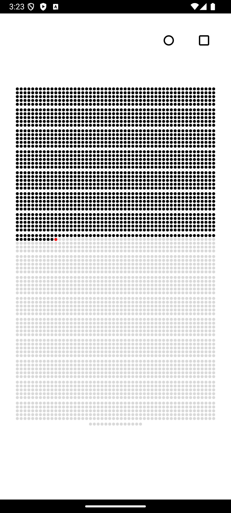
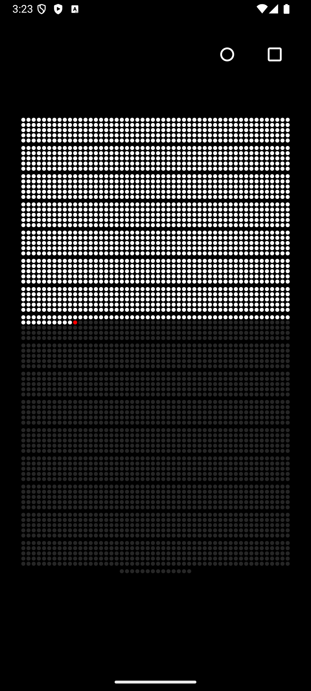

# Life Calendar

A minimalist Android app that visualizes your life in weeks. Each week of your life is represented by a dot, creating a simple yet powerful visualization of time.

## Features

- Clean, minimalist interface with a grid of dots representing weeks
- Automatic dark/light theme with system theme support and manual toggle
- Customizable birth date and life expectancy settings
- Modern adaptive icon with monochrome support

## Screenshots

<div align="center">
  
  
</div>

The app features a minimalist interface in both light and dark themes. The grid of dots represents weeks, with past weeks shown in solid color and future weeks in a lighter shade. The current week is highlighted, creating an intuitive visualization of life progress.

## Building the App

### Prerequisites

- Android Studio Arctic Fox or newer
- JDK 11 or newer
- Android SDK 33 (Android 13) or newer

### Steps

1. Clone the repository:
```bash
git clone https://github.com/ASBecker/life_calendar.git
```

2. Open the project in Android Studio

3. Build the app:
```bash
./gradlew assembleDebug
```

4. Install on a device:
```bash
adb install app/build/outputs/apk/debug/app-debug.apk
```

## License

This project is licensed under the MIT License - see the [LICENSE](LICENSE) file for details. 